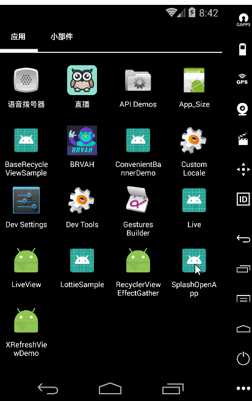

# app启动秒开

## 实现步骤
### 首先在res/drawable下新建一个layer-list，名字随便取，比如splash.xml：

	<?xml version="1.0" encoding="utf-8"?>
	<layer-list xmlns:android="http://schemas.android.com/apk/res/android">
    <!-- 背景颜色 -->
    <item android:drawable="@color/white" />
    <item>
        <!-- 图片 -->
        <bitmap
            android:gravity="center"
            android:src="@drawable/wel_page" />
    </item>
	</layer-list>
layer-list大家都会写吧，上面是背景颜色，下面是一张图，这张图可以是全屏的图，可以是一张小图。如果是全屏的图，那上面的颜色也可以不用设置，如果是小图，就要指定下颜色了，并且可以指定图片在位置。

### 给主题设置Window背景：

	

上面的<item name="android:windowBackground">可以用我们上面的layer-list作为背景，当然也可以设置个全屏的图片。

### 在AndroidManifest.xml中定义SplashActivity的theme为SplashTheme：

	<activity android:name=".SplashActivity" android:theme="@style/SplashTheme">
        <intent-filter>
            <action android:name="android.intent.action.MAIN"/>
            <category android:name="android.intent.category.LAUNCHER"/>
        </intent-filter>
	</activity>

### SplashActivity的实现，在onCreate()启动你的MainActivity即可，其他什么都别干：

	public class SplashActivity extends Activity 
	{
    	@Override
    	protected void onCreate(Bundle savedInstanceState) 
		{
        	super.onCreate(savedInstanceState);
        	startActivity(new Intent(this, MainActivity.class));
        	finish();
    	}
	}
